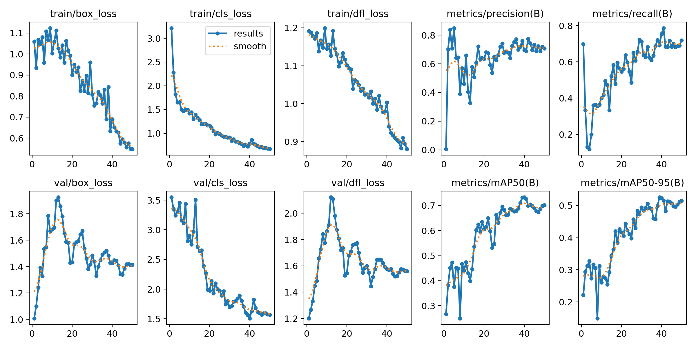
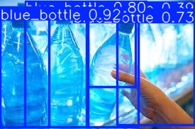
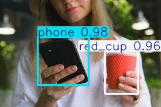
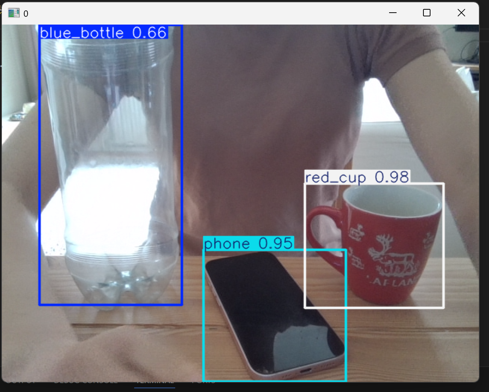

# YOLO Object Detection Project

## Project Overview

This project implements an object detection system using the YOLOv8 deep learning model.
The goal was to train a model capable of recognizing three everyday objects placed on a table:

- Red cup
- Blue bottle
- Phone

The model was trained on a custom dataset collected from photos and images downloaded from the internet. The system can detect these objects both in images and in real-time using a webcam.

---

# Dataset

The dataset was created specifically for this project. Images were collected using:

- smartphone camera
- publicly available images from the internet

The dataset contains images of:

- **red cups**
- **blue bottles**
- **phones**

Images were captured from different:

- angles
- lighting conditions
- distances
- backgrounds

Some images contain multiple objects in the same scene to make detection more realistic.

### Dataset size

- Training images: ~150–300
- Validation images: 44
- Total object instances: 114

### Dataset structure

```
dataset/
│
├── train/
│   ├── images/
│   └── labels/
│
├── valid/
│   ├── images/
│   └── labels/
│
└── data.yaml
```

Annotations were created using a bounding box annotation tool and exported in **YOLO format**.

---

# Model

The model was trained using the **YOLOv8 implementation from Ultralytics** with pretrained weights.

Model used:

```
yolov8n.pt
```

This is the smallest YOLOv8 model, which allows fast training even on CPU.

---

# Training

Training was performed using Python and the Ultralytics YOLO library.

Example training script:

```python
from ultralytics import YOLO

model = YOLO("yolov8n.pt")

model.train(
    data="data.yaml",
    epochs=50,
    imgsz=640
)
```

Training parameters:

- Epochs: **50**
- Image size: **640x640**
- Pretrained weights: **YOLOv8n**

---

# Results

Final validation performance:

| Metric    | Value     |
| --------- | --------- |
| Precision | 0.761     |
| Recall    | 0.692     |
| mAP50     | **0.731** |
| mAP50-95  | 0.526     |

### Performance per class

| Class       | mAP50     |
| ----------- | --------- |
| red_cup     | **0.964** |
| phone       | 0.768     |
| blue_bottle | 0.462     |

The model performed best on **red_cup**, while **blue_bottle** showed lower accuracy due to greater visual variability.

---

## Training Results

Training performance over 50 epochs.



# Example Predictions

The trained model was evaluated on unseen images.

Example command:

```python
model.predict(
    source="test_images",
    save=True,
    conf=0.25
)
```

Predictions include:

- bounding boxes
- class labels
- confidence scores

---

## Example Predictions

Example detections on unseen images.





# Real-Time Detection

The model can also run real-time detection using a webcam.

Example script:

```python
from ultralytics import YOLO

model = YOLO("runs/detect/train/weights/best.pt")

model.predict(
    source=0,
    show=True,
    conf=0.25
)
```

This demonstrates YOLO's ability to perform object detection in real time.

---

## Real-Time Detection

Example of real-time object detection using webcam.



# Technologies Used

- Python
- YOLOv8 (Ultralytics)
- PyTorch
- OpenCV
- Roboflow / Labeling tools

---

# Project Structure

```
YOLO-project/

dataset/
test_images/

training_script.py
test_model.py
webcam_detection.py

data.yaml

runs/
```

---

# Future Improvements

Possible improvements include:

- increasing dataset size
- improving class balance
- adding more object variations
- training for more epochs
- using a GPU for faster training

---

## Installation

Clone the repository:

git clone https://github.com/your-username/yolo-object-detection.git

cd yolo-object-detection

Install dependencies:

pip install -r requirements.txt

# Authors

Student Deep Learning Laboratory Project

Object detection system built using YOLOv8.
